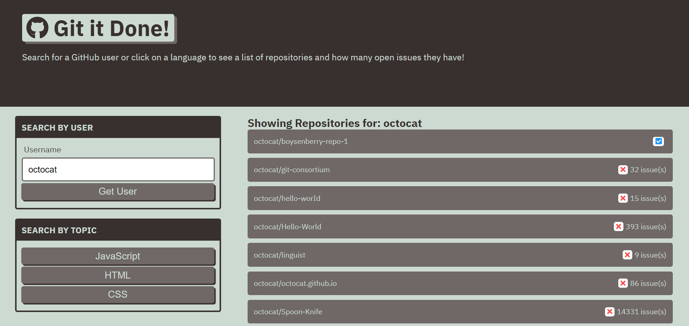

# git-it-done

Application live URL: https://houst29476.github.io/git-it-done

GitHub Repository URL: https://github.com/Houst29476/git-it-done

App Functionality Requirements:
- build web app that will search GitHub for:
    -  open source projects with open issues and pull requests

- connect app to GitHub API
    - show GitHub user open repositories in search results

